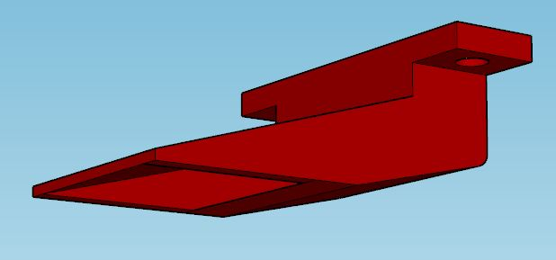

# Print Settings

# Support Removal
The parts are designed to not require slicer-generated supports. However, some parts include built-in supports that should be removed. Needlenose pliers are ideal for this task.

## X-ends
For the FuseBox2R, each x-end has 2 thin strips of plastic where one of the idler pulleys and its belt is supposed to fit.

## Carriage
For the FuseBox2, there is a strip of plastic underneath the fan duct that should be removed.

For the FuseBox2R, there are more supports that need to be removed. Probably best to show with a picture:

# Joining extrusions

# Fan Duct Options

FuseBox2R includes 2 cooling duct options:

## print-cooling-duct-a.stl

This is a conventional single-exit duct that directs air directly toward the nozzle.

## print-cooling-duct-b.stl

This is an experimental dual-exit duct that directs air toward the nozzle from opposite sides. Cooling may be more even but airflow is likely slightly less than the other duct. Before installing this duct, remove the support towers on each side.

