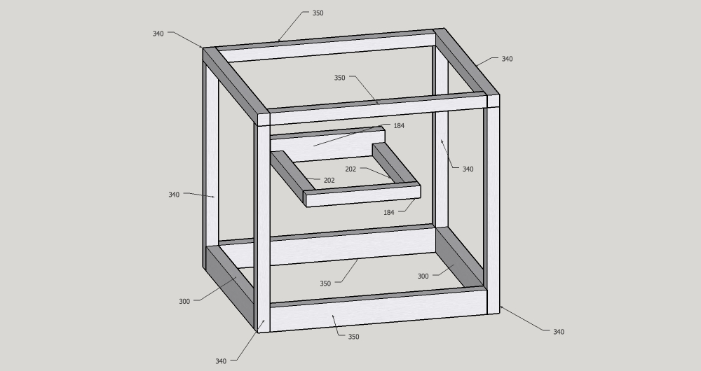
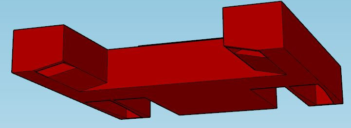

# Tools

* M3 and M5 hex keys
* Pliers
* 3mm wrench
* Power drill with ~5mm bit
* M5 tap

# Print settings
### Resolution

0.2mm or less

### Infill

25-30% is sufficient for most structural parts, but the x-ends, z bearing blocks, and carriage should be a bit more (35-50%). Infill can be lower for non-structural parts like the display enclosure, y-axis endstop holder, and plug box.

### Shells

At least 1.2-1.6mm thick (3-4 perimeters on a 0.4mm nozzle) for structural parts. X-ends, z bearing blocks, and carriage should use 1.6-2.0mm thickness (4-5 perimeters).

### Supports

Off for everything. Make sure your printer has good cooling, as many parts require good bridging abilities.

### Material

For most of the parts, PLA, PETG, ABS, and similar filaments are fine. PLA does seem to be more rigid so it is recommended for structural parts as long as the printer won't be in a hot car or similar. ABS or PETG should be used for the hotend cooling shroud. If your motors get hot, use these filaments for the motor mounts as well.

# Print finishing and support removal

Make sure to get rid of stringing or other rough areas where the linear bearings and rods are mounted to make installing those parts easier. Some parts may have a tight fit depending on your printer. To loosen up the linear rod holders, you can chuck a smooth rod in a drill and run it through the holder pieces - it'll take a bit of plastic off the inside.

The parts are designed to not require slicer-generated supports. However, some parts include built-in supports that should be removed. Needlenose pliers are ideal for this task.

## X-ends
For the FuseBox2R, each x-end has 2 thin strips of support where one of the idler pulleys and its belt is supposed to fit. Remove these using pliers and make sure there is no remaining material that could scrape the belt.

## Carriage
For the FuseBox2, there is a strip of plastic underneath the fan duct that can be torn off by hand.

For the FuseBox2R, there are more supports that need to be removed. Probably best to show with a picture:

# Joining extrusions

FuseBox2 optionally does away with corner brackets and instead uses a tap and drill method to join the extrusions - this results in a lower part count, a cleaner appearance, and likely greater rigidity. You can also use corner brackets, but if you have the tools and the time, tapping and drilling is recommended. If using corner brackets, you can replace the bottom 2040 extrusions with 2020 to reduce cost a bit.

To connect 2 extrusions perpendicularly, use an M5 tap to tap the end of the first extrusion. On the second extrusion, drill an access hole where you want the first extrusion to connect. Partially screw in a 12mm M5 bolt to the end of the first extrusion, and slip the bolt head into the channel of the second extrusion. Tighten down to attach the pieces rigidly together.

A more detailed explanation of how to connect extrusions using this method is available [here.](http://forums.reprap.org/read.php?177,601562)

# Assembly notes

## Frame

It is recommended to use the drilling and tapping technique described above to join the extrusions. Use the M5x12mm bolts for this. The extrusion lengths are shown below:

Following frame assembly, you can either work on the gantry assembly or the z-axis.

## Motor mounts and idler blocks

Attach the motor mounts and idler blocks onto the frame using the M5x8mm bolts and t-slot nuts.

To install the idler pulleys into the blocks, first place a spacer in position according to the images below. Partially insert an M3x25mm bolt from the spacer side until it is flush with the exposed end of the spacer. Then insert the idler pulley into position and push the bolt all the way through. Tighten down using a lock nut on the opposite side.

## Gantry assembly

Install the idler pulleys in each x-end using either a single M3x25mm bolt (dual rod gantry) or dual M3x18mm bolts (rail gantry). Then insert the linear bearings in the x-ends (rail gantry) or y bearing blocks (dual rod gantry). Note that for each of the rail gantry's x-ends, one of the idler pulley bolts goes in through where the linear bearing will be, so it must be installed before the bearing is inserted.

With the dual rod gantry, join the y bearing blocks with the x-ends using M3x25mm bolts and tighten down. Install the bearings in the carriage. Then insert two 8mm rods into one x-end and slip the carriage onto the rods, making sure it isn't backwards. Then put the remaining x-end on the other end of the rods.

The assembly process for the rail gantry is much easier. Use 4 M3x10mm socket head bolts and lock nuts to attach the rail to each x-end. Use 4 M3x6mm socket head bolts to attach the carriage to the rail. Dual M3x10mm button head bolts on each end are used to tighten down the linear bearings.

## Attaching the gantry

Insert the y rods into the idler blocks from the front of the machine and stop when about halfway through. Then slip the assembled gantry onto the rods. Then push the y rods all the way through to the motor mounts, and tighten each rod mounting point using an M3x10mm bolt. For the rail gantry, it is helpful to loosen the connection between the x-ends and the rail and tighten after the gantry is installed on the y rods.

## Belt attachment

TODO

## Carriage

TODO

## Z-Axis

TODO

## Electronics

TODO

# Fan duct options

FuseBox2R includes 2 cooling duct options:

## print-cooling-duct-a.stl

This is a conventional single-exit duct that directs air directly toward the area being printed.

## print-cooling-duct-b.stl

This is an experimental dual-exit duct that directs air toward the nozzle from opposite sides. Cooling may be more uniform but airflow is likely slightly less than the other duct. Before installing this duct, remove the support towers on each side.

